# 基于RT-Thread与LVGL的车载ADAS辅助驾驶面板

## 项目介绍

项目以NXP RT1060EVKB为硬件平台，通过LVGL GUI前端设计，与后端功能结合，实现一个现代化的车载ADAS辅助驾驶面板。

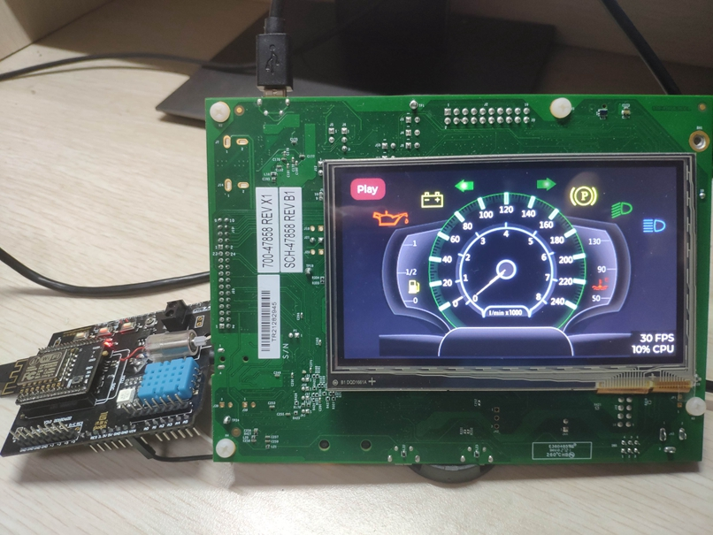

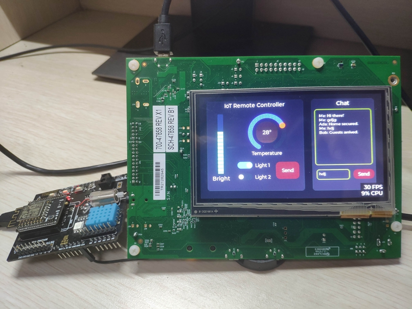

已实现功能：

1. 汽车仪表盘显示：汽车仪表盘为GUI主页面，显示汽车的时速、发动机转速、油量、转向灯、电池状态等信息，提供数据传入接口，以高刷新率显示，充分利用RT1060的LCD驱动能力。
2. IoT远程控制：开发板通过网卡接入互联网，连接位于云端的MQTT服务器，基于LVGL实现前端控制界面，实现远程控制家庭中的灯开关、亮度、空调温度的功能。
3. 远程聊天：基于LVGL的TextArea和Keyboard控件，结合MQTT实现ADAS车载系统与远程客户端聊天的功能。

## BOM 物料信息

### 硬件

- MIMXRT1060-EVKB

- LCD Screen: RK043FN66HS-CTG 480x272

- Network Interface Card: ESP8266

- Few wires

  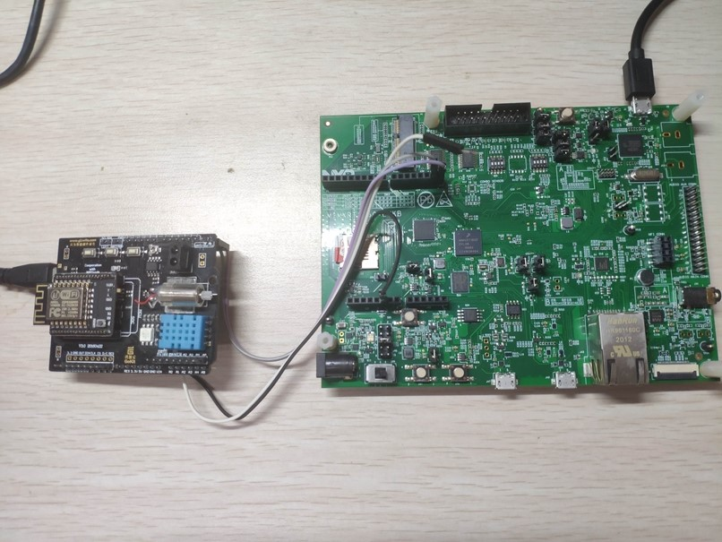

### 软件

- RT-Thread Env
- SquareLine Studio
- MDK5
- RT-Thread操作系统
- LVGL-latest
- at_device-latest
- cJSON-v1.0.2
- mymqtt-latest

## 项目构建

1. 首先，我们需要安装项目所需的开发环境：RT-Thread Env、MDK5、SquareLine Studio。

   - RT-Thread Env 是项目配置和构建工程的工具
   - MDK5 用来编译和下载代码
   - SquareLine Studio 用来设计 GUI，并导出 LVGL 的前端C代码

2. 从Github下载RT-Thread代码，链接：https://github.com/RT-Thread/rt-thread.git

   使用 RT-Thread Env 切换到 bsp/imxrt/imxrt1060-nxp-evk 目录下，启动 **menuconfig** 打开以下配置

   1. 启用 AT 网络组件

      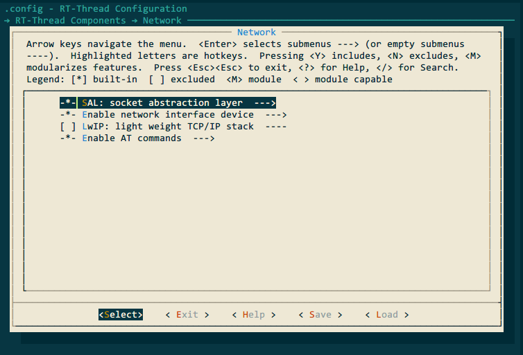

   2. 启用LVGL，适当增大线程栈大小，并设置刷新周期为33ms（默认刷新周期为5ms，刷新过快会产生显示异常）

      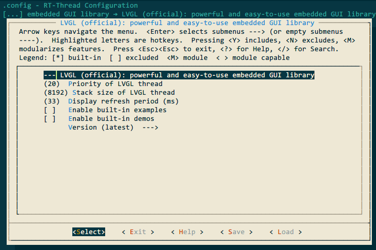

   3. 启用MQTT组件与AT网络设备

      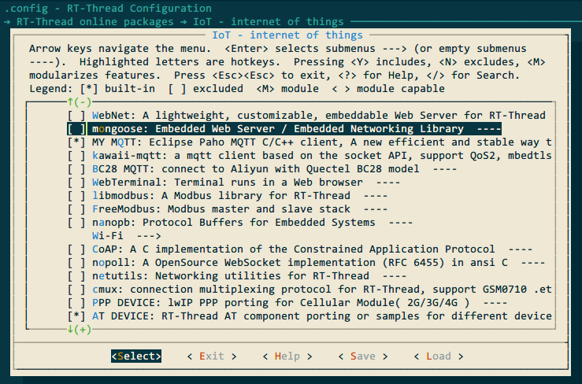

   4. 启用cJSON组件

      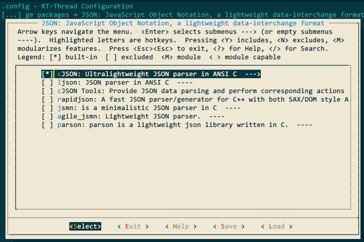

   5. 启用LCD、TOUCHPAD、LVGL以及SquareLine Studio支持

      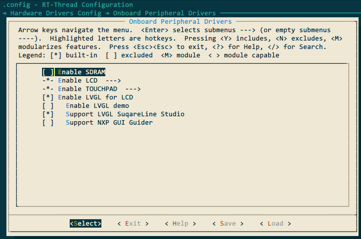

   6. 启用UART3等外设。完整的配置文件 **.config** 会在工程源码中提供，**menuconfig** 配置完成后，程序会自动下载相关组件，随后使用 **scons --target=mdk5** 命令生成MDK5工程。

3. 打开 SquareLine Studio，导入GUI 前端设计工程

   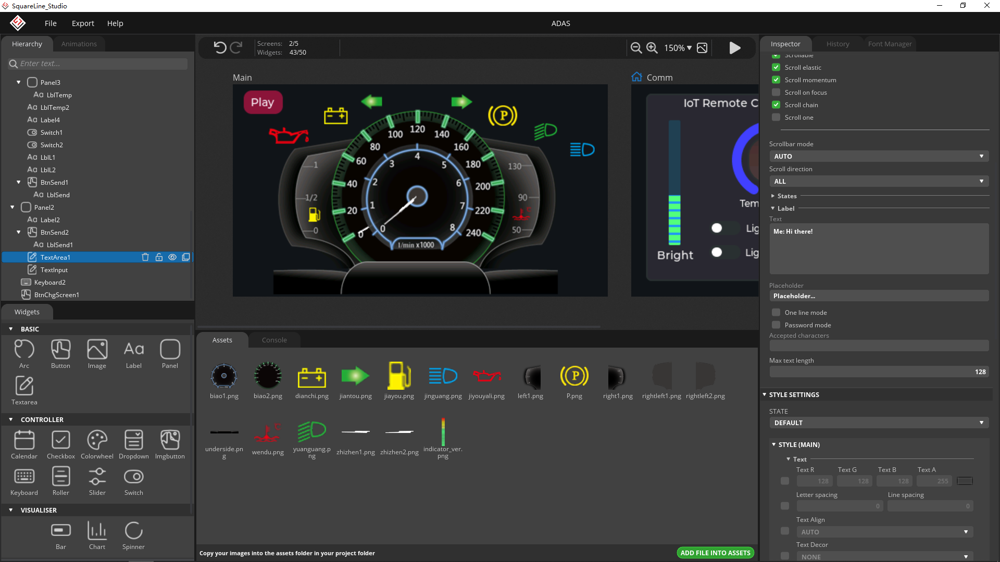

   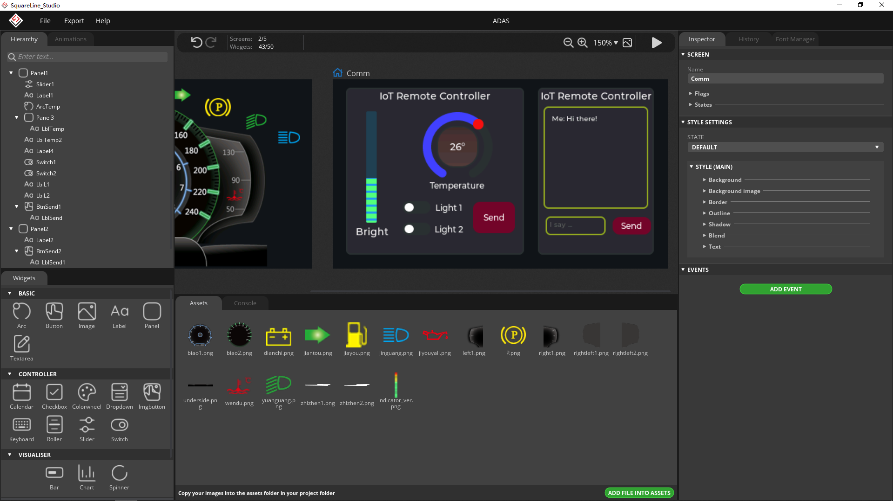

4. 完成前端GUI设计后，导出C代码，将其复制到 *imxrt1060-nxp-evk\applications\lvgl\squareline\ui* 目录下

5. MDK5 编译工程，并下载进开发板中

## 静态效果展示（图片）

主页面：汽车仪表盘

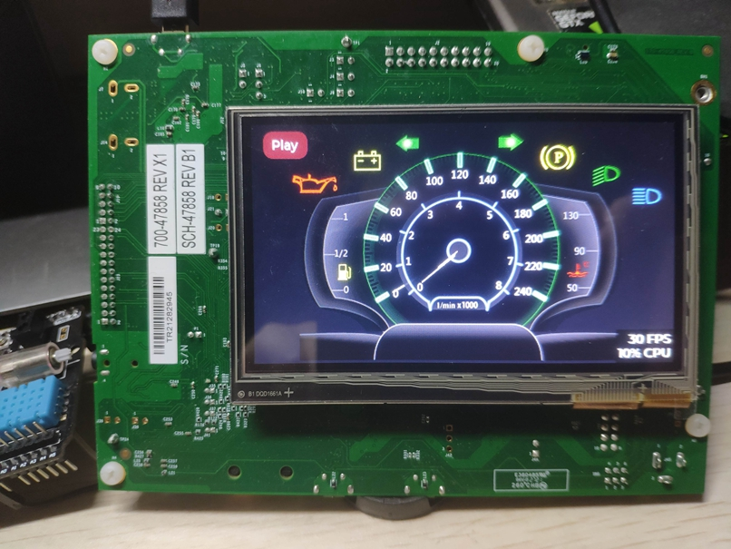

远程控制页面：IoT控制（左侧）、聊天框（右侧）

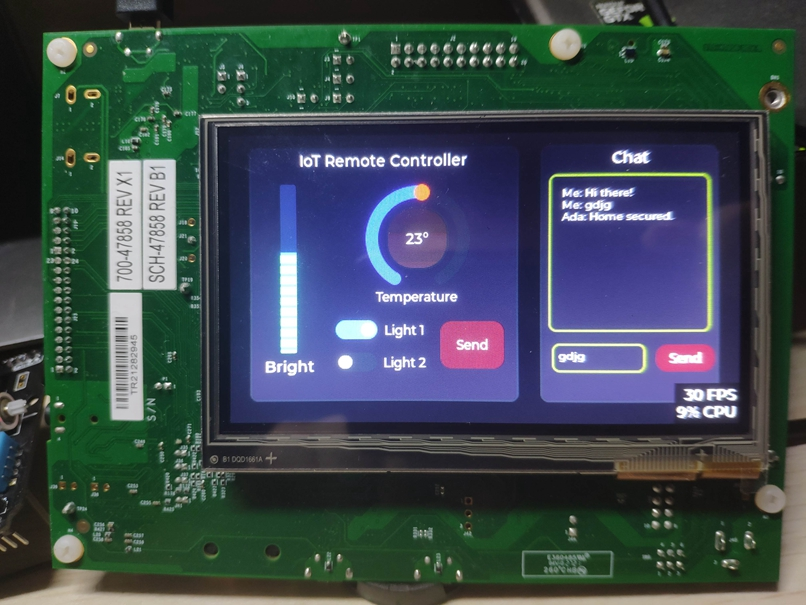

## 动画效果展示（视频）

展示视频 *show_video.mp4* 位于video文件夹

## 参考资料

1. [应用笔记](https://deepinout.com/lvgl-tutorials/lvgl-getting-started/lvgl-intro.html )

2. [官方文档](https://www.nxp.com.cn/design/development-boards/i-mx-evaluation-and-development-boards/i-mx-rt1060-evaluation-kit:MIMXRT1060-EVKB)

3. [wiki](http://lvgl.100ask.net/8.2/widgets/core/textarea.html#api)

