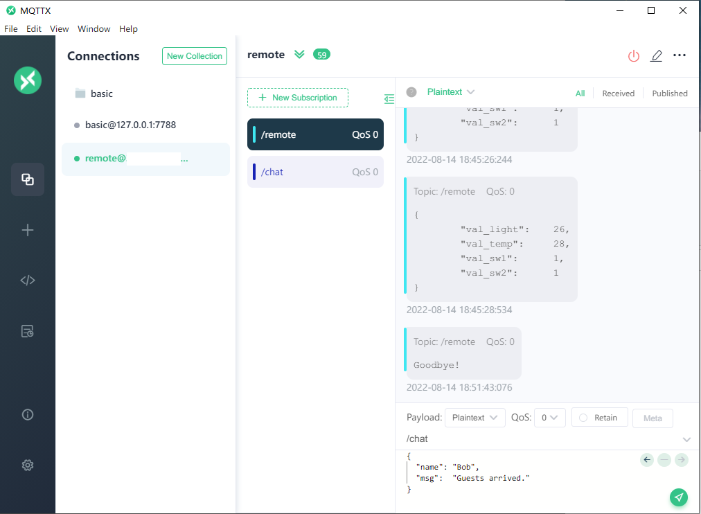

# Vehicle ADAS auxiliary panel based on RT-Thread and LVGL

<strong>
<samp>

[English](README.md) · [简体中文](README_CN.md)

</samp>
</strong>

## Project introduction

The project uses NXP RT1060EVKB as the hardware platform, through the front-end design of LVGL GUI and the combination of back-end functions, to realize a modern vehicle ADAS auxiliary driving panel. 

Implemented functions: 

1. Display of automobile instrument panel: the automobile instrument panel is the main page of GUI, which displays the information of automobile speed, engine speed, fuel quantity, steering light, battery status, etc., provides data input interface, displays it with high refresh rate, and makes full use of the LCD driving ability of RT1060. 
2. IoT remote control: the development board accesses the Internet through the network card, connects to the MQTT server located in the cloud, and realizes the front-end control interface based on LVGL to realize the function of remote control of light switch, brightness and air conditioning temperature in the home. 
3. Remote chat: Based on the TextArea and keyboard controls of LVGL, the function of chat between ADAS system and remote client is realized in combination with MQTT. 

## BOM information

### Hardware

- MIMXRT1060-EVKB

- LCD Screen: RK043FN66HS-CTG 480x272

- Network Interface Card: ESP8266

- Few wires

### Software

- RT-Thread Env
- SquareLine Studio
- MDK5
- RT-Thread OS
- LVGL-latest
- at_device-latest
- cJSON-v1.0.2
- mymqtt-latest

## Project construction

- First, we need to install the development environment required by the project: RT-Thread Env、MDK5、SquareLine Studio. 

  - RT-Thread Env is a tool for project configuration and build
  - MDK5 is used to compile and download code
  - SquareLine Studio is used to design gui and export the front-end C code of LVGL
- Download RT thread code from GitHub, link: https://github.com/RT-Thread/rt-thread.git

Use RT-Thread Env to switch to directory *bsp/imxrt/imxrt1060-nxp-evk*, and start **menuconfig** to open the following configuration

1. Enable AT network components

2. Enable LVGL, appropriately increase the thread stack size, and set the refresh period to 33ms (the default refresh period is 5ms, which is so fast that it will cause some displaying problems)

3. Enable MQTT components and at network devices

4. Enable the cJSON component

5. Enable LCD, TOUCHPAD, LVGL and SquareLine Studio support

6. Enable peripherals such as UART3. Complete configuration file *.config* will be provided in the project source code. After the **menuconfig**  configuration is completed, the program will automatically download the relevant components, and then use the **scons --target=mdk5** command to generate the MDK5 project. 

3. Open SquareLine Studio and import GUI front-end design project

4. After completing the front-end GUI design, export the C code and copy it to the *imxrt1060-nxp-evk\applications\lvgl\squareline\ui* directory

5. Compile the project and download it into the development board

## Static effect display (picture)

Home page: dashboard panel

Remote control page: IoT control (left), chat box (right)

PC sends and receives communication information

## Animation effect display (video)

Show video *show_video.mp4* is located in the video folder

## References

1. [application notes](https://deepinout.com/LVGL-tutorials/LVGL-getting-started/LVGL-intro.html)

2. [official documents](https://www.nxp.com.cn/design/development-boards/i-mx-evaluation-and-development-boards/i-mx-rt1060-evaluation-kit:MIMXRT1060-EVKB)

3. [wiki](http://LVGL.100ask.net/8.2/widgets/core/textarea.html#api)

